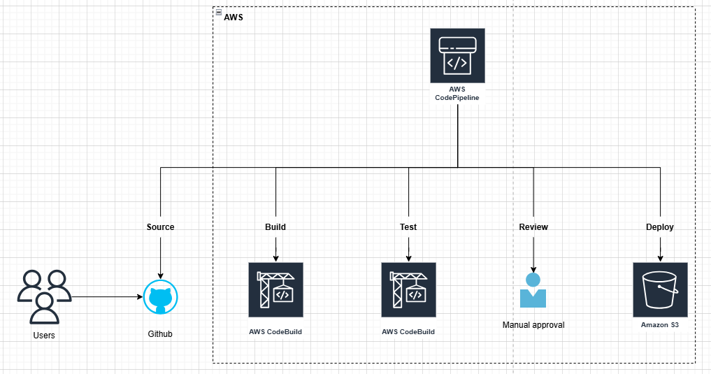

# Resume Website Deployment Pipeline

This project deploys a static resume website using AWS services, with a CI/CD pipeline that automates updates from a GitHub repository to an Amazon S3 bucket.

## Table of Contents
1. [Pipeline Architecture](#pipeline-architecture)
2. [Setup Steps](#setup-steps)
3. [Maintenance Guidelines](#maintenance-guidelines)
4. [Troubleshooting](#troubleshooting)

---

## Pipeline Architecture

This CI/CD pipeline consists of the following components:
- **GitHub**: Hosts the website code (index.html and style.css).
- **AWS CodePipeline**: Automates the CI/CD pipeline, monitoring the GitHub repository for changes.
- **AWS CodeBuild**: Builds the static website files, packaging them as artifacts for deployment.
- **Amazon S3**: Hosts the static website with public access and serves it as a static website.

### Architecture Diagram


## Setup Steps

### 1. Create an S3 Bucket
1. In the AWS Console, go to **S3** and create a new bucket.
2. Name the bucket `bucket-assignment4-emilysmileee`.
3. Under **Properties**, enable **Static Website Hosting**:
   - Set the **Index Document** to `index.html`.
4. Under **Permissions**, add a bucket policy to allow public access:
   ```json
   {
     "Version": "2012-10-17",
     "Statement": [
       {
         "Effect": "Allow",
         "Principal": "*",
         "Action": "s3:GetObject",
         "Resource": "arn:aws:s3:::bucket-assignment4-emilysmileee/*"
       }
     ]
   }
   ```

### 2. Set Up GitHub Repository
1. Create a new GitHub repository.
2. Add your website files (`index.html` and `styles.css`) and a `.gitignore` file.
3. Add a `buildspec.yml` file to define the build steps:
   ```yaml
   version: 0.1

   phases:
     build:
       commands:
         - echo "Building the static website..."
   artifacts:
     files:
       - '**/*'
   ```

### 3. Create CodePipeline
1. Go to **AWS CodePipeline** and create a new pipeline.
2. **Source Stage**:
   - Select **GitHub** as the source provider and connect to your repository.
   - Choose the branch `main` you want to monitor.
3. **Build Stage**:
   - Select **AWS CodeBuild** and create a new build project.
   - Choose a managed environment (e.g., Amazon Linux).
   - Set up the project to use the `buildspec.yml` file in your repository.


4. **Test Stage**:
   - Create another **AWS CodeBuild** project specifically for testing.
   - Use the following build commands in the **Test stage** to perform HTML validation:
   ```yaml
   version: 0.2

   phases:
   install:
      commands:
         - echo "Installing dependencies for testing..."
         - npm install -g html-validator-cli  # Install HTML validator
   pre_build:
      commands:
         - echo "Preparing for tests..."
   build:
      commands:
         - echo "Running HTML validation..."
         - html-validator --file=index.html --verbose  # Validate HTML file
   artifacts:
   files:
      - '**/*'
   ```
   
5. **Deploy Stage**:
   - Select **Amazon S3** as the deploy provider.
   - Choose your S3 bucket as the deployment destination.
   - Enable **Extract file before deploy** to ensure files are unzipped in S3.

### 4. Test the Pipeline
1. Make a change to `index.html` or `styles.css` and commit it to GitHub.
2. Verify that CodePipeline runs automatically and deploys the new files to S3.
3. Access the website via the S3 **Static Website Hosting** URL to see the changes.

## Maintenance Guidelines

### Regular Monitoring
- Check the pipeline status in **AWS CodePipeline** to ensure each stage completes successfully.
- Review **CodeBuild** logs for build errors if the pipeline fails.

### Updating the Pipeline
- To update the GitHub repository or S3 bucket configuration, edit the CodePipeline settings accordingly.
- For any build-related changes, update `buildspec.yml` and re-commit it to trigger a pipeline run.

### Permissions and Roles
- Ensure that IAM roles have appropriate permissions for CodePipeline, CodeBuild, and S3 access.
- Update IAM policies if permissions change in your AWS environment.

## Troubleshooting

### Common Issues

1. **Access Denied Error** in S3:
   - Verify that the S3 bucket policy allows public access.
   - Ensure that the object files are correctly deployed to the bucket.

2. **Build Failures**:
   - Check **CodeBuild** logs for errors in `buildspec.yml`.
   - Ensure the commands are correct and files are specified properly in the artifacts section.

3. **Test Failures**:
   - Review the **CodeBuild** logs for errors in the HTML validation step during the Test stage.
   - Ensure the `html-validator-cli` command is correct and the `index.html` file exists.

3. **Files Not Extracted in S3**:
   - Make sure "Extract file before deploy" is enabled in the deploy stage of CodePipeline.

### Logs and Debugging
- View CodePipeline execution history for detailed logs of each stage.
- Check **CloudWatch** logs for any CodeBuild-related errors.
